# 🚗 Automated Road Damage Detection Using UAV Images and Deep Learning Techniques

<p align="center">
  
  
  
  
  
  
  
</p>

<p align="center">
  <b>🎓 Major Capstone Project — B.Tech CSE</b><br/>
  Inspired by IEEE Access Research Paper — DOI: 10.1109/ACCESS.2023.3287770<br/>
  A deep learning-powered Django web application that automatically detects and classifies
  road surface damage from UAV (drone) images using YOLOv5 and YOLOv7,
  with separate portals for Users and Admins.
</p>

---

## 📌 Problem Statement

Road infrastructure damage — potholes, longitudinal cracks, transverse cracks, and alligator
cracks — causes thousands of accidents and billions in repair costs every year. Traditional
manual inspection is slow, expensive, and dangerous for workers. This project automates road
damage detection using **UAV (drone) aerial imagery** combined with **YOLOv5 and YOLOv7
deep learning models**, enabling faster, scalable, and cost-effective infrastructure monitoring.

---

## 📄 Research Reference

This project is inspired by and implements concepts from:

> **"Automated Road Damage Detection Using UAV Images and Deep Learning Techniques"**
> Luís Augusto Silva et al., IEEE Access, Volume 11, 2023
> DOI: [10.1109/ACCESS.2023.3287770](https://doi.org/10.1109/ACCESS.2023.3287770)

### Key Results from the Research Paper

| Model | mAP@0.5 | Precision | Recall | Inference Time |
|-------|---------|-----------|--------|----------------|
| YOLOv4 | 26.86% | 0.50 | 0.32 | 3s |
| YOLOv5x | 59.90% | 0.787 | 0.561 | 17.2ms |
| YOLOv5 + Transformer Head | 65.70% | 0.71 | 0.672 | 6.1ms |
| YOLOv7 | 73.20% | 0.788 | 0.714 | 11.4ms |

---

## 🎯 Damage Classes Detected

| Class Code | Damage Type |
|-----------|------------|
| D00 | Longitudinal Cracks |
| D10 | Transverse Cracks |
| D20 | Alligator Cracks |
| D40 | Potholes |
| — | Repair |
| — | Block Crack |

---

## ✨ Features

### 👤 User Portal
- ✅ User registration and secure login
- ✅ Upload UAV road images for damage detection
- ✅ View detection results with bounding boxes and confidence scores
- ✅ Browse personal detection history
- ✅ Download annotated result images

### 🔐 Admin Portal
- ✅ Admin login with separate dashboard
- ✅ View all user submissions and detection results
- ✅ Manage user accounts
- ✅ Monitor system-wide detection statistics

### 🧠 AI Detection Engine
- ✅ YOLOv5 and YOLOv7-based object detection
- ✅ Multi-class road damage classification (6 classes)
- ✅ Confidence score for each detected damage
- ✅ Bounding box annotated output image generation
- ✅ Transformer Prediction Head integration for improved accuracy

---

## 🛠️ Tech Stack

| Layer | Technology |
|-------|-----------|
| Deep Learning | YOLOv5, YOLOv7, YOLOv5+Transformer Head |
| Backend Framework | Django 4.x |
| Frontend | HTML5, CSS3, JavaScript |
| Database | SQLite3 |
| Image Processing | OpenCV, Pillow |
| Dataset Platform | Roboflow |
| Language | Python 3.9+ |

---

## 🗃️ Dataset

- **Spain Dataset**: 600 UAV images (DJI Air 2S drone, 50m altitude, 3840×2160px) — Classes: D00, D40
- **RDD2022 (CRDDC)**: 47,420 road images from 6 countries — Classes: D00, D10, D20, D40
- **Merged Dataset**: 4,873 images total (China UAV + Spain)
- **Split**: 82% Train (4000) / 12% Validation (584) / 6% Test (289)
- **Preprocessing**: Auto-orientation, resized to 640×640, ±15° rotation augmentation

---

## 📁 Project Structure

```
Automated-Road-Damage-Detection/
│
├── Automated_Road_Damage_Detection/   # Django project settings
│   ├── settings.py
│   ├── urls.py
│   └── wsgi.py
│
├── admins/                            # Admin portal app
│   ├── views.py
│   ├── models.py
│   └── templates/
│
├── users/                             # User portal app
│   ├── views.py
│   ├── models.py
│   └── templates/
│
├── assets/                            # Static files (CSS, JS, images)
├── media/                             # Uploaded & processed images
├── db.sqlite3                         # SQLite database
├── manage.py                          # Django entry point
├── requirements.txt                   # Python dependencies
├── .gitignore
└── README.md
```

---

## ⚙️ Setup Instructions

```bash
# 1. Clone the repository
git clone https://github.com/sujitha1706/Automated-Road-Damage-Detection-Using-UAV-Images-And-Deep-Learning-Techniques-Major-Project-.git
cd Automated-Road-Damage-Detection-Using-UAV-Images-And-Deep-Learning-Techniques-Major-Project-

# 2. Activate virtual environment
# Windows:
.venv\Scripts\activate
# Linux/Mac:
source .venv/bin/activate

# 3. Install dependencies
pip install -r requirements.txt

# 4. Apply database migrations
python manage.py migrate

# 5. Create superuser (admin)
python manage.py createsuperuser

# 6. Run the server
python manage.py runserver
```

- **User Portal**: http://127.0.0.1:8000
- **Admin Portal**: http://127.0.0.1:8000/admin

---
## 📸 Screenshots

### 🏠 Home Page
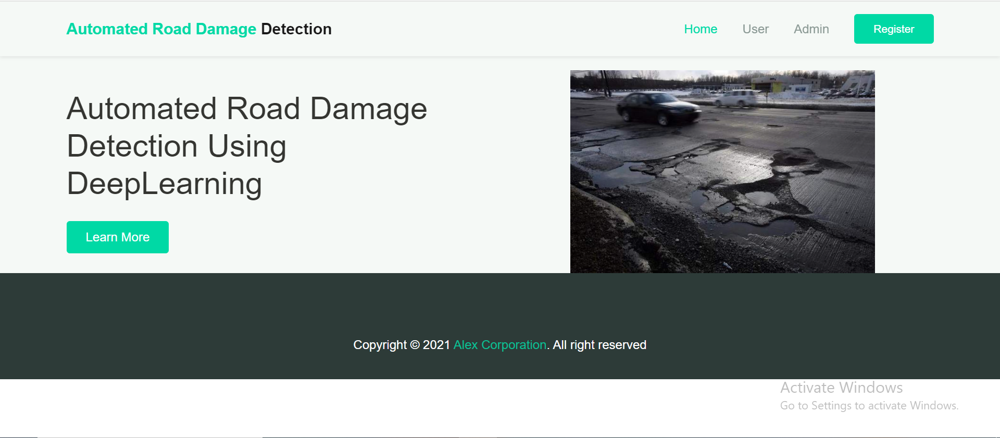

### 👤 User Registration
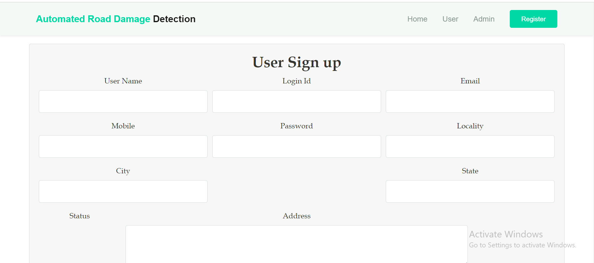

### 🔐 User Login
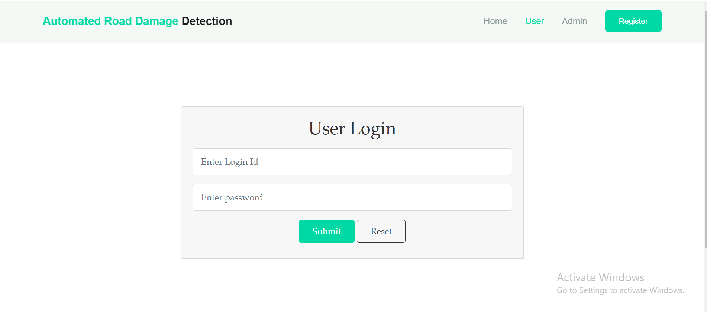

### 📊 User Dashboard
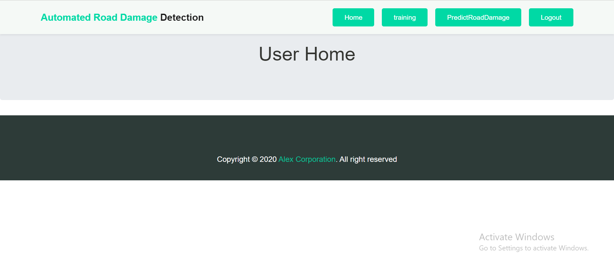

### 📤 Upload Image
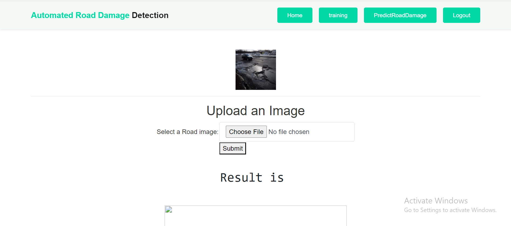

### 🔍 Detection Result
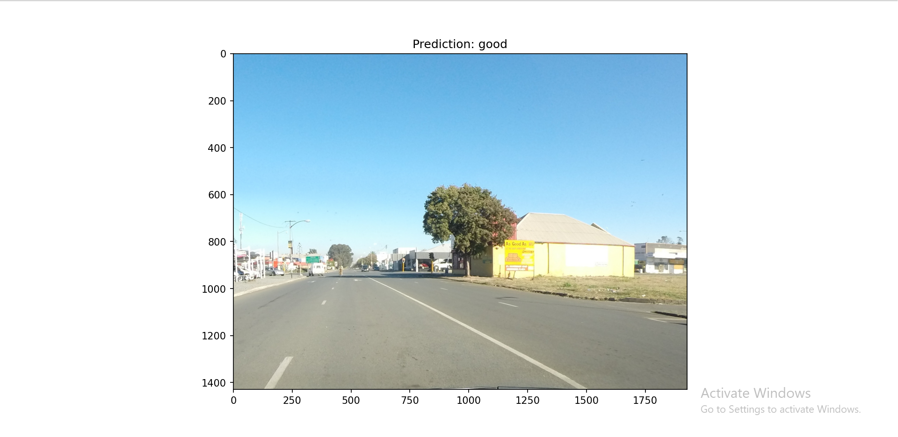
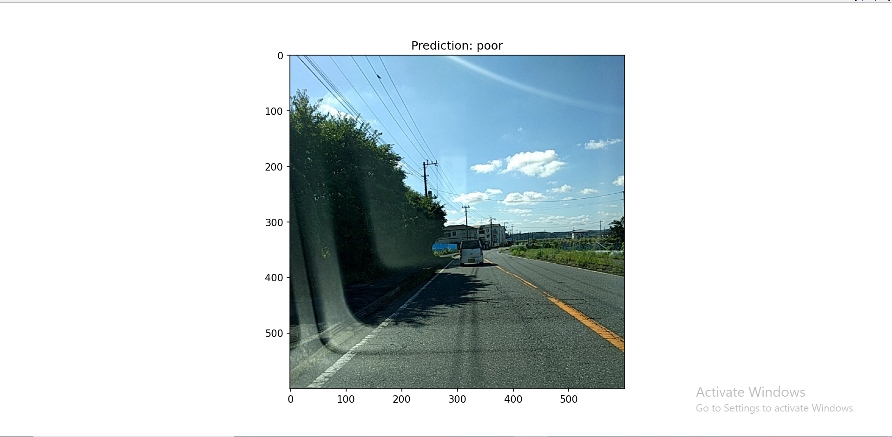
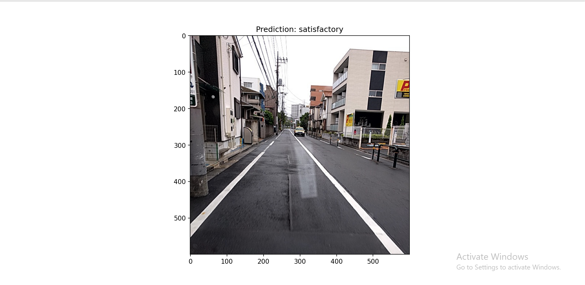

### 🔐 Admin Login
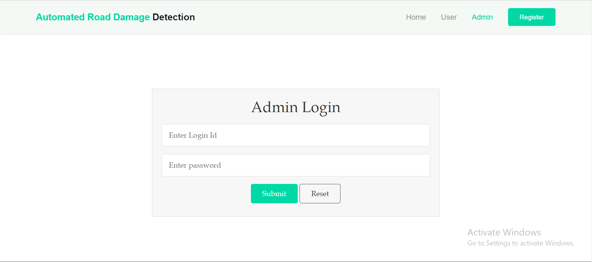

### 🛠️ Admin Dashboard
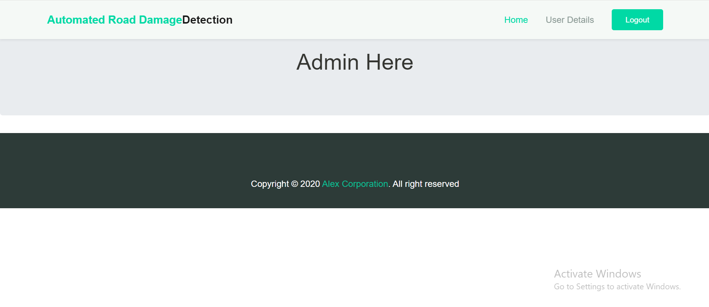

### 👥 Admin - User Management
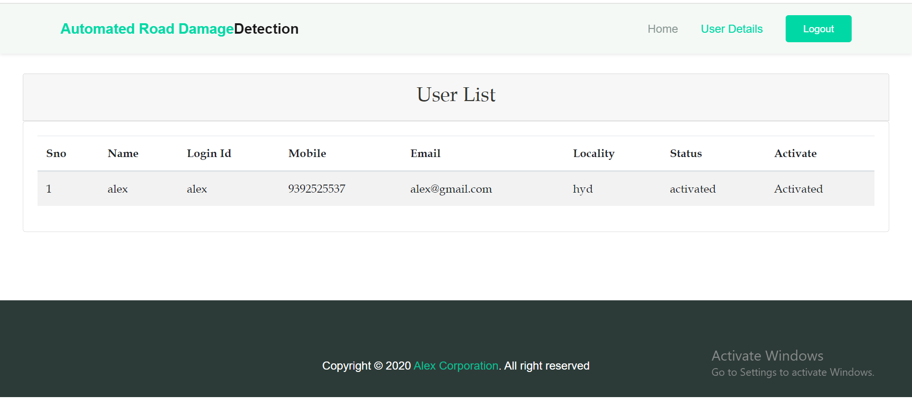

---

## 🔮 Future Enhancements

- [ ] Deploy to cloud (AWS / Render)
- [ ] Real-time video stream detection from live drone feed
- [ ] GPS-tagged damage location mapping with Google Maps
- [ ] PDF report generation for detected damages
- [ ] Multispectral and LiDAR sensor integration

---

## 👩‍💻 Author

**Sujitha Aparna Pepakayala**
- 🎓 B.Tech CSE — Major Capstone Project
- GitHub: [@sujitha1706](https://github.com/sujitha1706)
- LinkedIn: [sujitha-aparna-pepakayala](https://www.linkedin.com/in/sujitha-aparna-pepakayala-74b4b4278)
- Email: sujithaaparna1706@gmail.com

---

## 📜 License
MIT License — free to use and modify.

---

<p align="center">⭐ If you found this project useful, please star the repo! ⭐</p>
